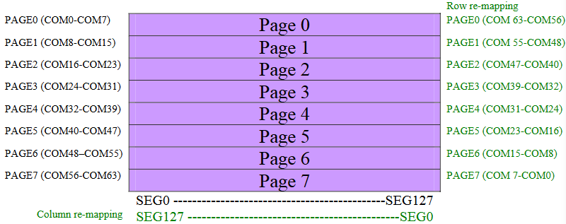
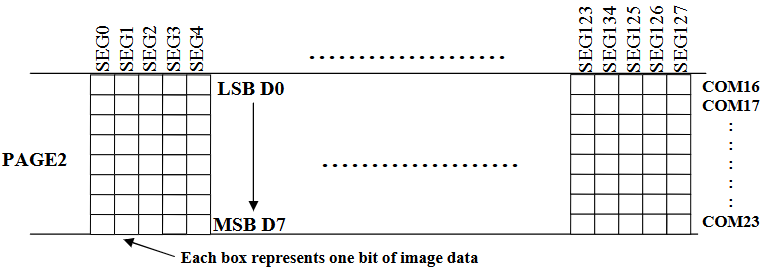

# content
- [Giới thiệu](#giới-thiệu)
- [THông số](#thông-số-cấu-hình)
- [Tập lệnh](#tập-lệnh)

# Giới thiệu
- SSD1306 là chip CMOS driver dành cho OLED/PLED lại common cathode (âm chung). 
- Gồm 128 segment (đề điều khiển cột) và 64 commons (điều khiển hàng)
- SEG (segment) và COM (common) là khái niệm dùng trong ma trận điều khiển của led.
- Khả năng điều chỉnh độ tương phản của các pixel là 256 mức 
- Hỗ trợ giao tiếp: Song song, SPI, I2C
- Có RAM tích hợp lưu trạng thái các led và bộ dao động nội để luân phiên chốt dữ liệu khi quét màn hình

# Thông số cấu hình
- VCC: từ 7V đến 15V, dùng được VCC 5V
- VDD: điện áp dùng cho logic từ 1.65V - 3.3V
- Có thể cấu hình tốc độ khung hình
- nhiệt độ hoạt động -40 đến 85 độ C

# Cấu trúc GDDRAM
- Graphic display data RAM (GDDRAM) được dùng để giữ các giá trị điểm ảnh người dùng setup thuật tiện cho việc quét màn ảnh.
- Kích thước 128x64 bits và được chia làm các PAGE (0 đến 7)
    - 
    - Khi 1 byte data được ghi vào GDDRAM toàn bộ điểm ảnh trên 1 segment (cột) trong 1 PAGE sẽ được ghi (sử dụng địa chỉ cột - segment để xác định)
        - 

# Clock
- Dao động nội Fosc: thường là 370khz, thấp nhất là 333kHz, cao nhất là 407kHz tùy vào cấu hình clock bên dưới
- Sau đó cho qua bộ chia được xác định bởi hệ số chia D
    - Hệ số chia D được xác định bằng lệnh cáu hình clock bên dưới
    - `DCLK = Fosc / D` được gọi là tần số màn hình `Display clock`

# Tập lệnh
- Các cờ cần chú ý là:
    |Cờ D/C|Cờ R/W|
    |-|-|
    |Data (1) /Command (0)|Write (0) /Read (1)|
- Ta có bảng đọc ghi vào GDDRAM của ssd1306
    |D/C|R/W|Comment|Address auto increment|
    |-|-|-|-|
    |0|0|Write Command|No|
    |0|1|Read Status|No|
    |1|0|Write Data|Yes|
    |1|1|Read Data|Yes|
- Command Table
    |D/C|Hexa code|D7|D6|D5|D4|D3|D2|D1|D0|Desription|
    |-|-|-|-|-|-|-|-|-|-|-|
    |-|-|-|-|-|-|-|-|-|-|**Khối lệnh cơ bản**|
    |0|81|1|0|0|0|0|0|0|1|`Cài đặt tương phản`   - Cần gửi kèm 1 byte xác định độ tương phản để chọn giá trị 1 đến 256|
    |0|A[7:0]|A7|A6|A5|A4|A3|A2|A1|A0|- byte cấu hình đi kèm, mặc định reset là 7Fh (127)|
    |0|A4/A5|1|0|1|0|0|0|1|X0|`Bật sáng toàn bộ màn hình`   - (Mặc định Reset) Nếu X0=0 thì là A4h, màn hình hiển thị tiếp dữ liệu RAM   - Nếu X0=1 thì là A5h, bật sáng toàn bộ màn hình|
    |0|A6/A7|1|0|1|0|0|1|1|X0|`Hiển thị thường hoặc đảo sáng`   - (Mặc định Reset) Nếu X0=0 thì là A6h, bit 0 là tắt, bit 1 là bật   - Nếu X0=1 thì là A7h, thì đảo lại|
    |0|AE/AF|1|0|1|0|0|0|1|X0|`Bật tắt màn hình`   - (Mặc định Reset) Nếu X0=0 thì là AEh, màn hình tắt đi   - Nếu X0=1 thì là AFh, bật màn hình lên|
    | |
    |-|-|-|-|-|-|-|-|-|-|**Khối lệnh quản lý địa chỉ**   *(Cần gửi liên tiếp 7 lệnh)*|
    | |
    |-|-|-|-|-|-|-|-|-|-|**Khối lệnh clock**|
    |0|D5|1|1|0|1|0|1|0|1|`Cấu hình clock hiển thị`   *(Cần gửi liên tiếp lệnh này và 1 lệnh cấu hình)*|
    |-|A[7:0]|A7|A6|A5|A4|A3|A2|A1|A0|- A[3:0] cấu hình hệ số chia D cho DCLK   Hệ số chia là A[3:0] + 1. Ví dụ 0000b là chia 1   - A[7:4] cấu hình tăng tần số nguồn dao động Fosc   Mặc định là 1000b khoảng 370khz. Có thể chỉnh từ 0000b đến 1111b|
    |0|D9|1|1|0|1|1|0|0|1|`Cấu hình clock Pre-charge`   *(Cần gửi liên tiếp lệnh này và 1 lệnh cấu hình)*|
    |-|A[7:0]|A7|A6|A5|A4|A3|A2|A1|A0|- A[3:0] Pre-charge-1 giai đoạn xả điện tích dữ   - A[7:4] Pre-charge-2 giai đoạn nạp điện tích trước trước khi quét tới   (Mặc định Reset) 22h|
    | |
    |-|-|-|-|-|-|-|-|-|-|***Khối lệnh cấu hình nâng cao***|
    |-|-|-|-|-|-|-|-|-|-|**Khối lệnh cấu hình phần cứng**   *(Cần gửi liên tiếp 7 lệnh)*|
    | |
    |-|-|-|-|-|-|-|-|-|-|**Khối lệnh cuộn**   *(Cần gửi liên tiếp 7 lệnh)*|
    |0|D5|1|1|0|1|0|1|0|1|`Cuộn ngang`   *(Cần gửi liên tiếp lệnh này và 1 lệnh cấu hình)*|
    |0|D5|1|1|0|1|0|1|0|1|`Cuộn chéo`   *(Cần gửi liên tiếp lệnh này và 1 lệnh cấu hình)*|
    |0|D5|1|1|0|1|0|1|0|1|`Cuộn dọc`   *(Cần gửi liên tiếp lệnh này và 1 lệnh cấu hình)*|

    

