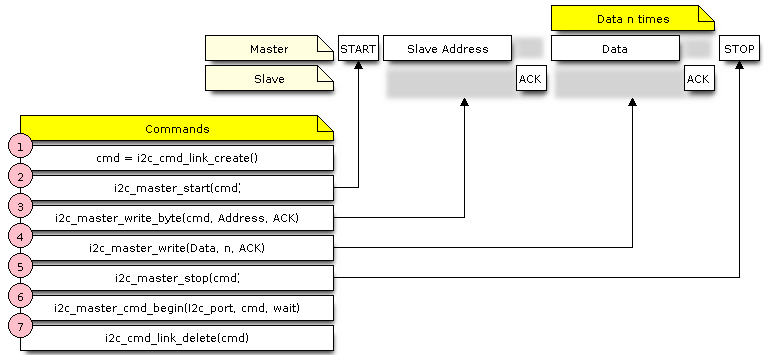
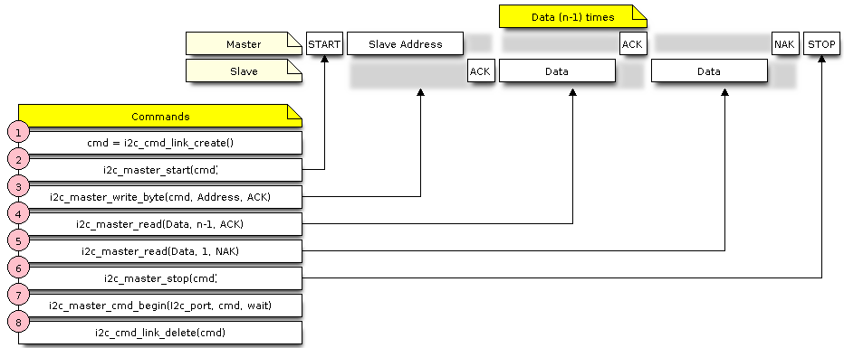

# nội dung
- [cấu hình](#cấu-hình-các-thông-số)
- [cài đặt](#cài-đặt-driver)
- [giao tiếp](#giao-tiếp)
- [đăng ký ngắt](#ngắt-i2c)
- [điều chỉnh thông số](#điều-chỉnh-thông-số)
- [kết thúc](#kết-thúc)


# cấu hình các thông số
Trước khi bắt đầu giao tiếp i2c, ngay trước khi bật module i2c chúng ta cần cấu hình thông số làm việc:
- Esp32 support tốc độ standart là 100kbps và fastmode là 400kbps.
- Esp32 có 2 giao diện i2c vậy nên cần chọn thông qua một biến `i2c_master_port`, mặc định nó là kiểu `int`
    ```c
    typedef int i2c_port_t
    // I2C port number, can be I2C_NUM_0 ~ (I2C_NUM_MAX-1).
    // MACROS: I2C_NUM_0, I2C_NUM_1, I2C_NUM_MAX
    ```
- thông số cài đặt của struct `i2c_config_t`:
    ```c
    // thông số chung cho cả master và slave
    i2c_mode_t mode
    int sda_io_num
    int scl_io_num
    bool sda_pullup_en
    bool scl_pullup_en

    // thông số đi kèm với master
    uint32_t clk_speed
    uint32_t clk_flags

    // thông số đi kèm với slave
    uint8_t addr_10bit_en
    uint16_t slave_addr
    uint32_t maximum_speed
    
    ```

## Cấu hình cho master hoặc slave
- Cấu hình master
```c
int i2c_master_port = 0;
i2c_config_t conf = {
    .mode = I2C_MODE_MASTER,
    .sda_io_num = I2C_MASTER_SDA_IO,         // select GPIO specific to your project
    .sda_pullup_en = GPIO_PULLUP_ENABLE,
    .scl_io_num = I2C_MASTER_SCL_IO,         // select GPIO specific to your project
    .scl_pullup_en = GPIO_PULLUP_ENABLE,
    .master.clk_speed = I2C_MASTER_FREQ_HZ,  // select frequency specific to your project
    // .clk_flags = 0,          /*!< Optional, you can use I2C_SCLK_SRC_FLAG_* flags to choose i2c source clock here. */
};
```

- Cấu hình slave
```c
int i2c_slave_port = I2C_SLAVE_NUM;
i2c_config_t conf_slave = {
    .sda_io_num = I2C_SLAVE_SDA_IO,          // select GPIO specific to your project
    .sda_pullup_en = GPIO_PULLUP_ENABLE,
    .scl_io_num = I2C_SLAVE_SCL_IO,          // select GPIO specific to your project
    .scl_pullup_en = GPIO_PULLUP_ENABLE,
    .mode = I2C_MODE_SLAVE,
    .slave.addr_10bit_en = 0,
    .slave.slave_addr = ESP_SLAVE_ADDR,      // address of your project
};
```

# cài đặt driver
Sử dụng hàm `i2c_driver_install()` để cài đặt các thông số đã cấu hình cho ngoại vi i2c.


# giao tiếp
- Tốt nhất vẫn là đọc và ghi 1 - 1 là an toàn nhất nếu không muốn quản lý tượng lớn data
- esp32 hỗ trợ ram cho module i2c, có thể đọc thêm trong [manual](../Doc/esp32_technical_reference_manual_en.pdf)

1. Master mode
- Master write  
  
- Master read  
  

2. Slave mode
- Chế độ này thường `nên nhưng không bắt buộc` đi kèm ngắt để đảm bảo phản ứng kịp thời.

- Slave read buffer
    - Khi master gửi thông điệp đến slave, thông điệp sẽ được lưu vào RX buffer
    - Dùng hàm `i2c_slave_read_buffer()` để đọc thông điệp

- Slave write buffer
    - Sau khi nhận được 1 yêu cầu gửi dữ liệu từ master, Slave sẽ bắt đầu chuẩn bị dữ liệu thông qua ghi vào TX buffer
    - Dùng hàm `i2c_slave_write_buffer()` để ghi vào buffer

# ngắt i2c

# điều chỉnh thông số

# xử lý lỗi

# kết thúc