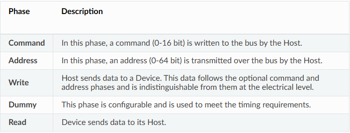

# Nội dung
- [Giới thiệu](#giới-thiệu)
- [Lưu ý](#lưu-ý)
- [Giao tiếp](#hàm-giao-tiếp)

# Giới thiệu
- ESP32 hộ trợ 4 SPI nhưng chỉ có SPI2(HSPI) và SPI3(VSPI) dùng được/
- Các pha trong 1 giao tiếp (transaction) thường thấy:
    - 
    - Bât kì pha nào cũng có thể được bỏ qua
    - Các thuộc tính của pha giao tiếp được quyết định bởi biến:
        - cấu hình bus (cấu hình chân, thông số spi) `spi_bus_config_t`
        - biến câu hình thiết bị đích (slave) `spi_device_interface_config_t`
        - biến cấu hình cấu trúc giao tiếp (gửi gì) `spi_transaction_t`

# Lưu ý
- Lưu ý khi gửi dữ liệu bằng DMA:
    1.  DMA chỉ chấp nhận vùng nhớ RAM được cấp phát bắt đầu với địa chỉ chia hết cho 4
        - Mỗi dữ lần xử lý DMA xử lý theo cụm dữ liệu 32bit
    2. Khi gửi các dữ liệu > 8byte như 16, 32bit thì DMA không quan tâm đến kiểu bố trí dữ liệu như bigendian hay litte endian.
        - Bởi vì đường truyền thường yêu cầu `Big` endian mà esp32 cấu trúc vùng nhớ theo `little` endian
        - DMA chỉ biết gửi đi từng byte dữ liệu từ địa chỉ thấp lên cao khi hoạt động ở SPI
        - như vậy cần phải đảo thứ tự byte trước khi được gửi đi nếu `slave yêu cầu big endian`
        và đào thứ tự byte khi nhận từ slave
    3. Nếu slave chỉ yêu cầu little endian thì không cần swap làm gì
    4. DMA không yêu cầu kích thước buffer là chia hết cho 4 nhưng tốt nhất vẫn là cấp phát chia hết.

# Hàm giao tiếp