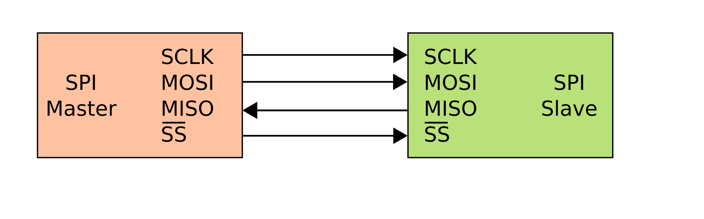
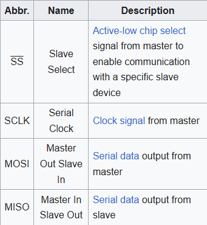
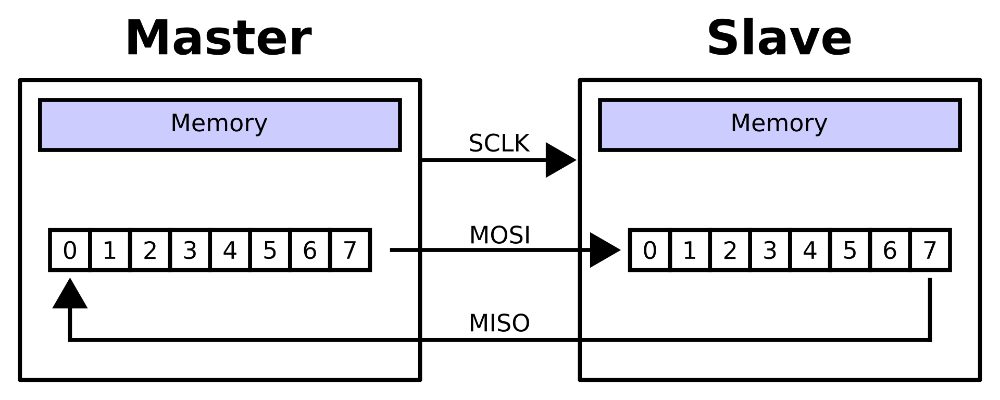
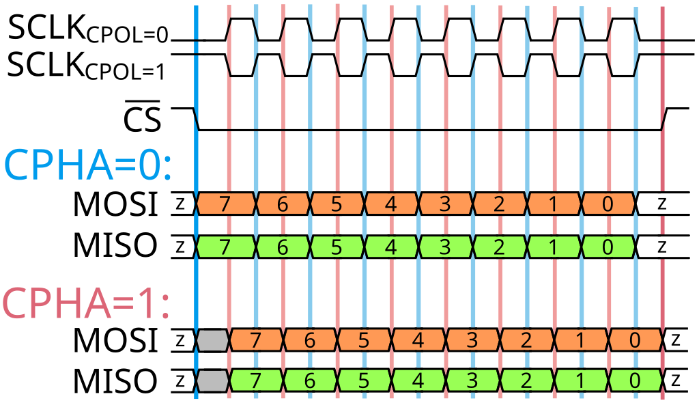
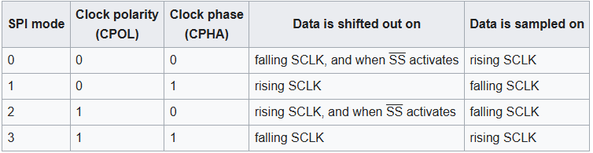
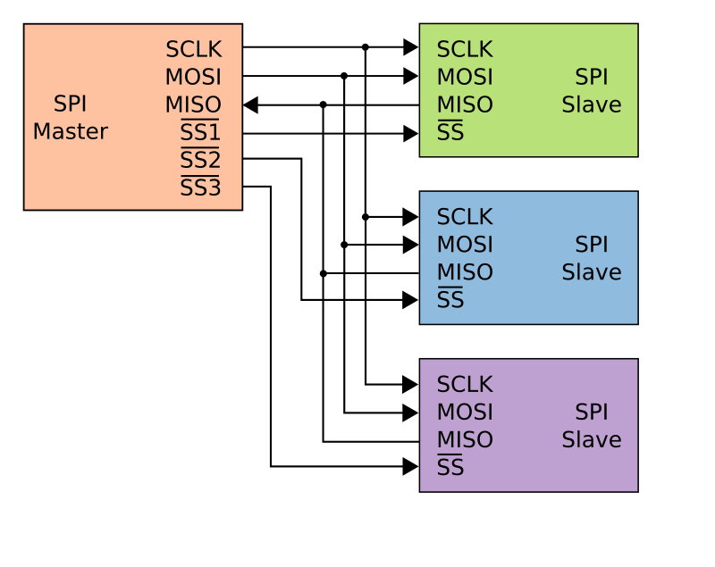
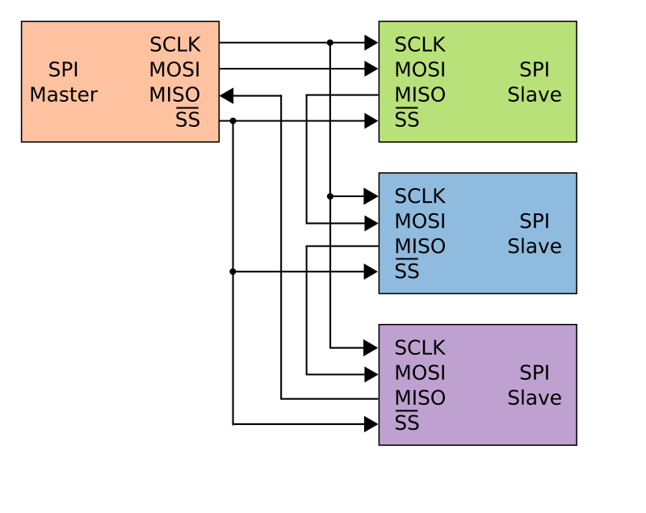

# Giới thiệu
- SPI hay Serial Peripheral Interface là chuẩn giao tiếp ngoại vi theo kiểu đồng bộ.
- SPI tuân theo kiến trúc master-slave với một 1 thiết bị điều khiển mội vài thiết bị slave được điều khiển bằng tín hiệu clock và tín hiệu chip select.
- Khác I2C có thể multimaster, multi slave

# Hoạt động
## Cấu hình cơ bản
- 
- Các chân kết nối:
    - 
    - `Slave select` hay `Chip select-CS` có gạch trên đầu thể hiện active low level
    - `Serial Clock` cung cấp tín hiệu clock để điều khiển slave
    - `MOSI` Data output từ master
    - `MISO` Data output từ slave
## Truyền dữ liệu
- 
- Mặc định SPI truyền dữ liệu theo thứ tự MSB đi trước. Một số phần cứng có thể hỗ trợ truyền LSB thông qua bit LSBFE nếu có.
- Mỗi lần bắt đầu gửi dữ liệu, dữ liệu cần được chốt trước khi ghi lên thanh ghi dịch.
- SPI sử dụng cùng 1 thanh ghi dịch cho truyền nhận dữ liệu vậy nên luôn đồng thời có thể vừa gửi và nhận dữ liệu. Sau mỗi lần truyền 8bit phải đọc hoặc chốt dữ liệu mới lên thanh ghi.

### Phân cực cho Clock và pha
- 
- CPOL và CPHA (clock polarity and clock phase)
    - CPOL nói đến sự phân cực khi nhàn rỗi của tín hiệu Serial Clock, ở đây có thể có 2 giá trị là:
        - SCLK_CPOL = 0 , ám chỉ clock đang nhàn rỗi ở mức 0 thì bắt đầu phát clock
        - SCLK_CPOL = 1 , ám chỉ clock đang nhàn rỗi ở mức 1 thì bắt đầu phát clock
    - CPHA nói về pha lấy mẫu bit data trong 1 chu kỳ truyền dẫn dữ liệu:
        - Khi thiết bị được chọn bởi Slave select, dữ liệu bắt đầu được trao đổi theo 2 khả năng được thiết kế:
            - CPHA = 0 : bit data được lấy mẫu ngay ở sườn thay đổi trạng thái nhàn rỗi.
            - CPHA = 1 : bit data được lấy mẫu tại sườn kế tiếp sau khi thay đổi trạng thái nhàn rỗi.
- Như vậy có 1 vấn đề là không phải thiết bị nào cũng hỗ trợ CPOL và CPHA giống nhau? làm sao để xác định và rõ ràng khi xét các model truyền dẫn thì chỉ có truyền song song là phù hợp.

- Các chế độ rút ra từ CPOL và CPHA:
    -  
- Một số vi điều khiển hỗ trợ truyền nhiều chế độ trong 1 phiên giao tiếp, có thể gửi ở một chế độ nhưng nhận ở chế độ khác mà vẫn đảm bảo nội dung trao đổi.

### Các kiểu truyền dẫn
- Có 2 model truyền phổ biến là:
    - Multidrop configuration
        - 
        - Cấu hình này thường được ưu chuộng vì tốc độ cao và khả năng tương thích nhiều thiết bị
        - Nhược điểm là cần IC mở rộng chận
    - Daisy chain configuration
        - 
        - Chế độ này rõ ràng chỉ thích hợp khi các thiết bị đồng bộ về chế độ truyền. Chỉ thích hợp với chuỗi các thiết bị cùng loại.
- Ngoài ra còn có chể độ mở rộng, chúng ta mix giữa 2 chế độ multidrop và daisy chain