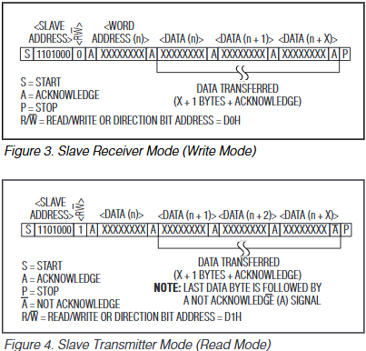
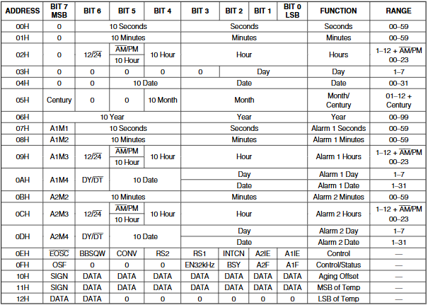
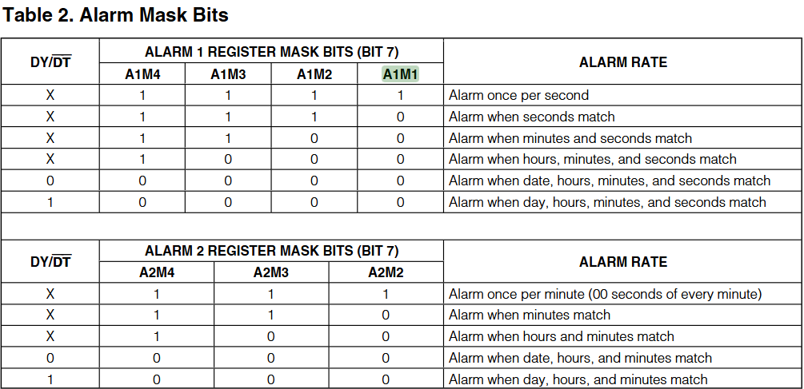
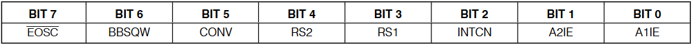
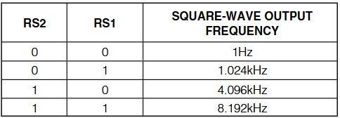
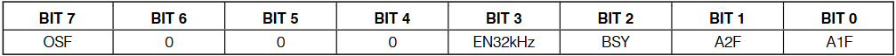

# Tập lệnh
- 
- 
- DS3231 biểu diễn dữ liệu thanh ghi theo định dạng BCD (binary coded decimal) vì vậy nó dành 4 bit dành cho biểu diễn từ 0 - 9 cho hàng đơn vị và 1 vài bit dùng cho hàng chục
- DS3231 có các thanh ghi cơ bản cần lưu ý:
    - 00H: thanh ghi giây (00-59)
        - bit[3:0] hàng đơn vị (0000 - 1001)
        - bit[6:4] hàng chục (000 - 101)
    - 01H: thanh ghi phút (00-59)
        - bit[3:0] hàng đơn vị (0000 - 1001)
        - bit[6:4] hàng chục (000 - 101)
    - 02H: thanh ghi giờ (1-12) /hoặc/ (00-23)
        - Chọn chế độ bằng bit[6]
            - bit[6] = 1 -> chế độ 12 tiếng:
                - bit[3:0] hàng đơn vị (0000 - 1001)
                - bit[4]   hàng chục (0 - 1)
                - bit[5] = 0 là sáng, 1 là buổi chiều
            - bit[6] = 0 -> chế độ 24 tiếng:
                - bit[3:0] hàng đơn vị (0000 - 1001)
                - bit[5:4] hàng chục (00 - 10)
    - 03H: thanh ghi ngày trong tuần (1-7)
        - bit[2:0] từ thứ 2 đến chủ nhật (001-111)
    - 04H: thanh ghi ngày trong tháng (00-31)
        - bit[3:0] hàng đơn vị (0000 - 1001)
        - bit[5:4] hàng chục (00 - 11)
    - 05H: thanh ghi tháng và thế kỷ (01-12 + thế kỷ chẵn lẻ (vd 0 cho thế kỷ 20, 1 cho 21))
        - thế kỷ
            - bit[7] đây đơn giản là bit sẽ đảo giá trị sau khi mà năm 99 -> 00
                - qui ước dựa theo lập trình viên
        - tháng
            - bit[3:0] hàng đơn vị (0000 - 1001)
            - bit[4]   hàng chục (0 - 1)
    - 06H: thanh ghi năm (0-99)
        - bit[3:0] hàng đơn vị (0000 - 1001)
        - bit[7:4] hàng chục (0000 - 1001)
- Thanh ghi báo thức:
    - 
    - 07H: thanh ghi báo thức 1 - giây
        - bit[7] A1M1
        - bit[3:0] hàng đơn vị (0000 - 1001)
        - bit[6:4] hàng chục (000 - 101)
    - 08H: thanh ghi báo thức 1 - phút
        - bit[7] A1M2
        - bit[3:0] hàng đơn vị (0000 - 1001)
        - bit[6:4] hàng chục (000 - 101)
    - 09H: thanh ghi báo thức 1 - giờ
        - bit[7] A1M3
        - Chọn chế độ thời gian bằng bit[6]
            - bit[6] = 1 -> chế độ 12 tiếng:
                - bit[3:0] hàng đơn vị (0000 - 1001)
                - bit[4]   hàng chục (0 - 1)
                - bit[5] = 0 là sáng, 1 là buổi chiều
            - bit[6] = 0 -> chế độ 24 tiếng:
                - bit[3:0] hàng đơn vị (0000 - 1001)
                - bit[5:4] hàng chục (00 - 10)
    - 0AH: thanh ghi báo thức 1 - ngày trong tuần /hoặc/ ngày trong tháng
        - bit[7] A1M4
        - bit[6] = 0 là chế độ ngày trong tháng, 1 là ngày trong tuần
            - ngày trong tuần: (1-7)
                - bit[3:0] tương ứng (0001-0111)
            - ngày trong tháng: (1-31)
                - bit[3:0] tương ứng hàng đơn (0000-1001)
                - bit[5:4] tương ứng hàng chục đơn (00-11)
    - thanh ghi giờ báo thức 2 tương tự nhưng sẽ không có giây:
        - 0BH: thanh ghi báo thức 2 - phút ( không phải giây )
            - bit[7] A2M2
        - 0CH: thanh ghi báo thức 2 - giờ
            - bit[7] A2M3
        - 0DH: thanh ghi báo thức 2 - ngày trong tuần /hoặc/ ngày trong tháng
            - bit[7] A2M4
- Thanh ghi điều hành (nên đọc vào và dùng các phép toán `|=` (set bit), `&=~` (clear bit), `^=` (toggle bit) để xử lý từng bit):
    - 0EH: thanh ghi điều khiển
        - 
        - bit[7]: Enable oscillator 
            - mặc định: 0 là bật dao động, 1 là tắt dao động
            - dĩ nhiên khi tắt dao động thì thời gian sẽ bị dừng lại.
            - bit này `chỉ có tác dụng` khi ngắt Vcc và `dùng Vbat (pin)`
            - khi bật `Vcc` sẽ luôn bật xung dao động `(thiết bị luôn hoạt động)` bất kết set là 0 hay 1
        - bit[6]: Battery-Backed Square-Wave Enable
            - mặc định: 1 là chế độ phát xung (SQW), 0 là chế độ ngắt báo thức (interrupt)
            - Chế độ này `chỉ có tác dụng` khi dùng `pin`, không có tác dụng khi dùng Vcc
            - Mặc định tự cài thành 0 khi quay lại Vcc mode
            - Để điều khiển ở `Vcc mode hãy xem bit[2]`
        - bit[5]: Convert Temperature
            - Khi set thành 1 sẽ đo nhiệt độ, khi ấy bit status BSY ở thanh status sẽ chuyển thành 1.
            - khi đo xong thì 2 thanh ghi nhiệt sẽ được update (mất khoảng 2ms) và tự động set bit[5] và bit trạng thái tương ứng lại thành 0.
            - Tốt nhất không nên dùng vì tốn năng lượng, module tự có cơ chế đo sau mỗi 64 giây
        - bit[4:3]
            - Tương ứng là các bit RS2 và RS1 sẽ cài tần số xung vuông xuất ra
            - 
        - bit[2]: interrupt control
            - Ở chế độ Vcc, khi set bit[2] là 0 sẽ phát xung vuông qua SQW pin, và khi set là 1 thì ở chế độ ngắt alarm
        - bit[1]: kích hoạt ngắt alarm 2
        - bit[0]: kích hoạt ngắt alarm 1
    - 0FH: thanh ghi trạng thái và một vài bit điều khiển chưa xét:
        - các trạng thái sẽ phản ánh kết quả của thanh ghi `control register`
        - 
        - bit[7] = 1 khi dao động bị tắt bởi bit[7] của thanh ghi control register
        - bit[6:4] luôn bằng 0
        - bit[3] Enable 32kHz Output
            - khi set 0 thì trở kháng ra cao và không có tín hiệu ra
            - khi set 1 (mặc định khi cấp Vcc) thì phát xung 32.768kHz
        - bit[2] Busy
            - bit này có giá trị 1 ngay khi bit[5] của thanh ghi điều khiển kích hoạt đo nhiệt độ
            - sau khi đo thành công bị này tự trở về 0 sau 1 phút
        - bit[1] và bit[0] là các bit cờ báo hiệu sự kiện ngắt báo thức đã đến. bit này chỉ có thể set được về 0 và nếu set 1 sẽ chả có thay đổi gì.
    - 10H: thanh ghi aging offset (nhiệt)
    - 11H: thanh ghi MSB of temp (nhiệt)
    - 12H: thanh ghi LSB of temp (nhiệt)
    