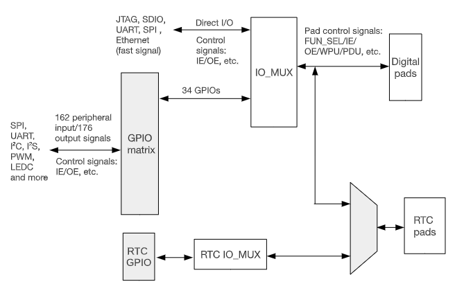
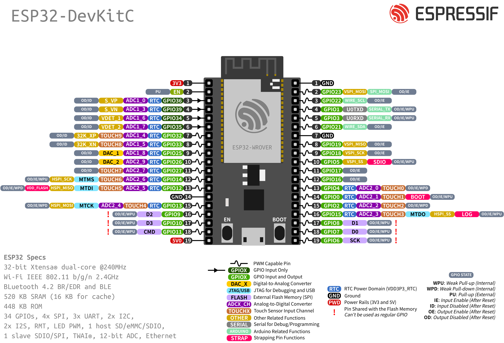

# ESP32 GPIO
## Overview
- ESP32 có `34` chân GPIO vật lý sử dụng kết nối các khối ngoại vi bên trong MCU hoặc I/O bình thường
- 
    - Các khối chức năng định tuyến tín hiệu: `IO MUX`, `RTC IOMUX` và `GPIO matrix`
        - `IO MUX` chứa nhiều thanh ghi mà mỗi thanh ghi cấu hình cho 1 GPIO tương ứng, cho biết GPIO được cấu hình cho mục đích gì và thực hiện chức năng tương ứng.
        - `GPIO matrix` hỗ trợ remap (ánh xạ) chân của các module ngoại vi như I2C, I2S, UART, SPI, PWM, LEDC...
            - có khoảng 162 input và 176 output signal
        - `RTC mux` chỉ hỗ trợ các GPIO có hỗ trợ RTC, có khả năng hoạt động ngay cả khi esp32 sleep.
        - `Digital pads` và `RTC pads` đại diện cho các GPIO vật lý sau khi được cấu hình trên esp32.
## Lưu ý các chân có thể dùng
- 
    - Các GPIO trên `esp32` có thể dùng và cần lưu ý trước khi dùng:
        - `0-19`, `21-23`, `25-27`, `32-33` là các chân I/O
        - `34-39` là các chân input only
    - Các GPIO trên board `devkitC` có thể dùng:
        - Các GPIO có thể dùng: `0-5`, `12-19`, `21-23`, `25-27`, `32-33` và `34-39`
        - Các GPIO cần lưu ý `Trap-pin` sẽ bị chiếm dụng trước khi chạy chương trình, không nên gắn trở kéo ở bên ngoài mạch:
            - GPIO 0: pull-up khi khởi động
            - GPIO 5: pull-up khi khởi động
            - GPIO 12: pull-down khi khởi động
            - GPIO 15: pull-up khi khởi động

