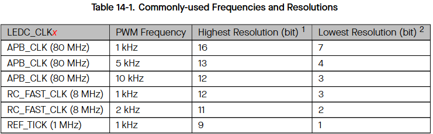

# ledc
- 
- source: esp32 refernce manual
- demo: 

# mcpwm
- esp32 có 2 đơn vị mcpwm
- mỗi đơn vị có 3 timer
- mỗi timer điều khiển 2 đầu ra A và B
- mỗi timer của mcpwm 8bit chia tần số prescaler
- thanh ghi đếm 16bit có thể đếm thuận và đảo
- 