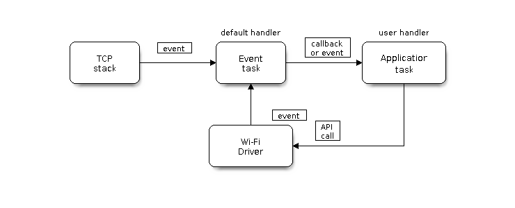
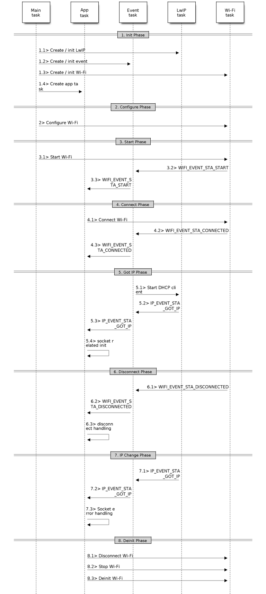
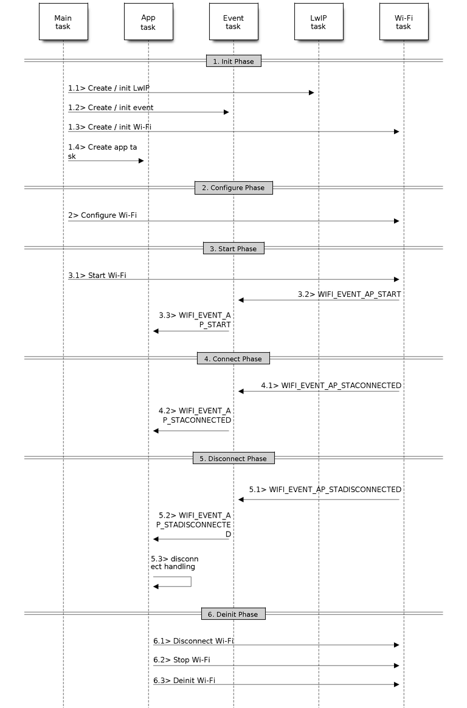
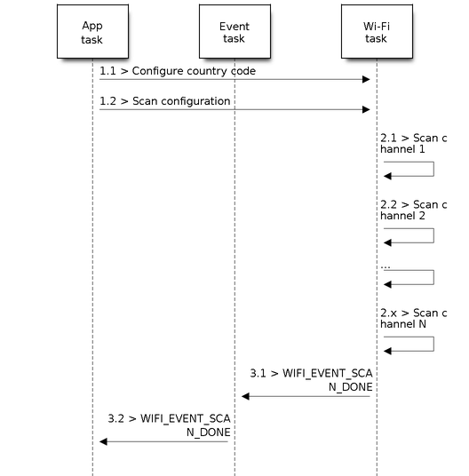

<head>
  
</head>

# nội dung
- [esp32 wifi overview](#esp32-wifi-driver)
- [esp32 wifi station mode](#station-mode)
- [esp32 wifi access point mode](#ap-mode)

# Esp32 Wifi driver

## Tính năng hỗ trợ
- 4 giao diện:
    - station: connect to Wifi
    - access point: create a wifi network
    - sniffer: capture and analyze network
    - reserved
- chế độ kết nối: station only, AP only, STA/AP coexistence
- Chuẩn wifi hỗ trợ: IEEE 802.11b (2.4GHz / 11Mbps), IEEE 802.11g(2.4GHz / 54Mbps) ,IEEE 802.11n (2.4GHz / 150Mbps)
    - 802.11n support 5GHz but esp32 no support
- Bảo mật:
    - WPA/WPA2/WPA3
    - WPA2 - enterprise
    - WPS
- TCP throughput max: 20Mbit/s , UDP throughput max: 30Mbit/s
- support fast scan and all-channel scan

## Mô hình khởi tạp vào quản lý wifi
- 
    - Wifi Driver (Physical Layer - Layer 1, Data Link Layer - Layer 2):
        + Quản lý kết nối mạng
        + Là giao diện xử lý layer thấp trong mô hình OSI: physic layer (1), datalinks layer (2) | tương đương Physical layer trong TCP/IP.
        + Wi-Fi driver nhận các tín hiệu điều khiển từ `Application Task` qua API, sau đó thực thi các tác vụ mạng và chuyển các sự kiện phát sinh cho `Event Task` để tiếp tục xử lý và callback lại cho ứng dụng.
    - TCP task (Network Layer - Layer 3, Transport Layer - Layer 4):
        - Quản lý dựa nên `LwIP`
        - xử lý các kết nối mạng trong Network Layer và Transport Layer. TCP/IP stack của ESP32 sẽ đảm nhiệm việc giao tiếp mạng qua giao thức IP (Lớp 3) và TCP/UDP (Lớp 4). Tương đương `Network` và `Transport` trong TCP layer
        - Khi có sự kiện xảy ra trong kết nối mạng (như kết nối thành công, có dữ liệu mới, hoặc lỗi mạng), `TCP task` sẽ gọi lại các callback đã đăng ký và gửi các sự kiện này đến Event Task.
    - Even task:
        - Nhận sự kiện từ cả `Wi-Fi driver và TCP task,` và sau đó gọi lại các hàm xử lý tương ứng (callback) mà `Application Task` đã đăng ký trước đó. Điều này giúp ứng dụng nhận được thông báo về trạng thái mạng và xử lý các tình huống phát sinh.
        - ESP 32 event task là 1 bộ trung chuyển sẽ nhận POST từ 1 group nào đó kèm theo id như 1 cờ báo cho 1 sự kiện sẽ được đăng ký. Mội handler khác sẽ đăng ký vào đó kèm theo id mong muốn của group với 1 hàm call back để báo hiệu khi có POST.
        - Có thể thấy nó khác giống với mô hình mạng Pub-Sub với broker là `Event Tasks`
    - Application task (layer 5 - 7):
        - là tác vụ tạo ra từ người dùng , sẽ nhân được sự kiện hoặc callback lại từ `Event task`. Ứng dụng có thể thực hiện các hành động như gửi/nhận dữ liệu, hoặc thay đổi trạng thái kết nối dựa trên các sự kiện đó.
        - `Application Task` có thể gửi các yêu cầu tới `Wi-Fi driver` thông qua API để thực thi các nhiệm vụ mạng, như thiết lập kết nối, thay đổi mạng, hoặc khôi phục kết nối.
        -  Khi ứng dụng yêu cầu sử dụng các giao thức như MQTT, HTTPS, hoặc các giao thức quản lý phiên và bảo mật, thì ứng dụng có thể cần các tầng Session (Layer 5) và Presentation (Layer 6) để quản lý kết nối và mã hóa dữ liệu. Các handler cho những giao thức này sẽ giúp xử lý các tính năng bảo mật, nén dữ liệu hoặc chuyển đổi định dạng khi cần.

# Station mode
- 

## 1. Init phase
1. `main` task hoặc function nào đó , gọi đến hàm  `esp_netif_init()` để khởi tạo LwIP core task và các nhiệm vụ đi kèm.
2. tiếp tục gọi ` esp_event_loop_create()` để tạo `Event task` và đăng ký các call back function
3. tiếp tuc gọi `esp_netif_create_default_wifi_ap()` hoặc `esp_netif_create_default_wifi_sta()` để tạo một instance giao diện mạng liên kết chế độ wifi như AP hoặc Station tới LwIP (TCP/IP stack).
4. tiếp tục gọi ` esp_wifi_init()` để tạo ra `wifi driver task` rồi nó sẽ khởi tạo `Wifi driver`. Nó sẽ xử lý phần cứng WiFi, MAC layer, quản lý scan, kết nối, ngắt, v.v.
5. Người dùng viết code để quản lý các sự kiện

## 2. Wifi configuration phase
1. Đầu tiên sau khi khởi tạo là chúng ta sẽ cài chế độ kết nối: ` esp_wifi_set_mode()` và sử dụng cờ `WIFI_MODE_STA`
2. Lưu ý, nếu NVS flash nằm trong menu config được tick thì các cấu hình từ bước 2 trở đi sẽ được update vào trong Non-volatile flash để sử dụng lại được sau khi tắt nguồn hoặc reboot:
    - `Compiler config -> Wi-Fi -> WiFi NVS flash `

## 2.5. set country , set config inform for wifi
- set config before scan wifi or using ssid and password (update in NVS)
- [link](https://docs.espressif.com/projects/esp-idf/en/v4.4.8/esp32/api-guides/wifi.html#esp32-wi-fi-scan)

## 3. Wifi start phase
1. gọi `esp_wifi_start()` để gửi lệnh kích hoạt wifi đến `Wifi driver`
2. sau đó `WiFi driver` sẽ xử lý sự kiện đó và phản hồi `post` lên hệ thống `Event task`, có thể là sự kiện đã xong, failed, ...  
    - Ở đây sẽ có cờ `WIFI_EVENT_STA_START ` có thể được phản hồi lên.
    - Nếu trước đó đã đăng ký callback funtion với `Event task` với sự kiện nguồn là `WIFI_EVENT_STA_START` thì callback
    sẽ được thực hiện.

## 3.5  Scan phase
- [explain](#wifi-scan)
- [link](https://docs.espressif.com/projects/esp-idf/en/v4.4.8/esp32/api-guides/wifi.html#esp32-wi-fi-scan)

## 4. Wifi connect phase
1. Sau khi đã start được `wifi driver` chúng ta bắt đầu kết nối đến mạng và quét wifi gần đó bằng ` esp_wifi_connect() `
2. Nếu quét thành công tìm thấy SSID nó sẽ kết nối theo mật khẩu đã cấu hình từ trước.
3. Nếu thành công, sự kiện `WIFI_EVENT_STA_CONNECTED` sẽ được phản hồi ngược lại là ` WIFI_EVENT_STA_DISCONNECTED` nếu access point không được tìm ra hoặc sai password,...

## 5. Wifi got IP phase
1. Sau khi kết nối thành công tại bước trên, `Wifi driver` tự đông thực hiện DHCP để lấy IP từ access point
2. Mã trả về cho `Event task` có thể là:
    - `IP_EVENT_STA_GOT_IP` nếu thành công nhận được ip
    - Còn nếu không phản hồi DHCP xem bước tiếp theo
    - Không khởi tạo socket trước bước này vì nó vô dụng khi chưa kết nối mạng, IP, port.

## 6. Disconnect khi gặp sự cố
1. Khi hệ thống không phải hồi do AP bị tắt hoặc xung đột nào đó, phản hồi về `Event task` là `WIFI_EVENT_STA_DISCONNECTED `
2. Nếu hệ thống đóng giữa chừng mà đang có các `socket` vẫn tồn đọng thì nó sẽ vô dụng và phải hủy thủ công.
3. Sau bước này nếu cần hủy các socket đã tạo và tái kết nối phải gọi lại từ bước 4 để kết nối lại.

## 7. WiFi IP change phase
1. Nếu IP thay đổi, sự kiện `IP_EVENT_STA_GOT_IP` sẽ được kích hoạt
2. Sau bước này tốt nhất là khởi tạo lại toàn bộ socket.

## 8. De-init Wifi
1. esp_wifi_disconnect() <- ngắt kết nối wifi
2. esp_wifi_stop()       <- ngừng Wifi driver
3. esp_wifi_deinit()     <- giải phóng tài nguyên đã chiếm dụng khi khởi tạo

# AP mode
- 
- AP mode khá giống STA, chỉ ít hơn mội vài khâu như:
    + Không cần `esp_wifi_connect` ở bước 4 vì là access point
    + IP change và got IP vì nó ở Access point mode.

## 1. Init Phase
## 2. Configure phase
## 3. Start phase 
## 4. Connect phase
## 5. Disconnect phase
## 6. Deinit phase

# Addendum

## Wifi scan
- 

1. gọi ` esp_wifi_set_country()` để cấu hình quét wifi theo quốc gia
2. gọi ` esp_wifi_scan_start()` để bắt đầu quét mạng
3. Wifi driver sau đó sẽ quét các kênh dựa trên `country code` đã cài trước đó và theo kênh được yêu cầu
4. Khi scan xong cờ ` WIFI_EVENT_SCAN_DONE ` sẽ báo hiệu cho `event task` gọi callback xử lý danh sách wifi thu được
5. gọi ` esp_wifi_scan_get_ap_num()` để lấy số lượng AP quét thành công
6. gọi ` esp_wifi_scan_get_ap_records()` để lấy danh sach AP
    - **Lưu ý**:
        - Chỉ được gọi 1 lần `esp_wifi_scan_get_ap_records()` mỗi khi sự kiện `WIFI_EVENT_SCAN_DONE` được kích hoạt.
        - Bắt buộc gọi 1 lần `esp_wifi_scan_get_ap_records()` mỗi khi sự kiện `WIFI_EVENT_SCAN_DONE` được kích hoạt.
            - Lý do ở đây là hệ thống không tự free khi quét xong nếu `esp_wifi_scan_get_ap_records` không được gọi.