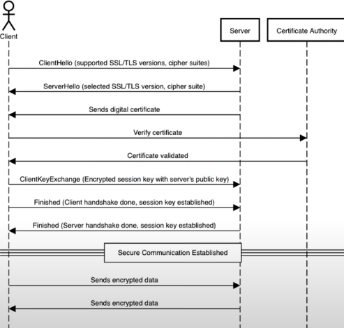

# Content

# Tổng quan
- Hỗ trợ: TCP (mqtt://), SSL (mqtts://), Websocket (ws://), Websocket sercure (wss://)
- Support multiple clients in application
- Support
    + subcribing, publishing
    + authentication
    + last will messages
    + keep alive pings
    + 3 QoS levels

# Cấu hình
1. URI hỗ trợ định dạng bảo mật: mqtt, mqtts, ws, wss
2. SSL (sercure socket layer):
- Qui trình chuẩn để xác thực cần thiết như sau:
    - 
- Tuy nhiên các hàm API trong ví dụ không thực hiện bước xác thực chữ ký số
    - Thay vào đó tin tưởng vào phản hồi từ server mqtt, bao gồm:
        - Thông tin về server
        - Khóa công khai của server để client mã hóa khóa phiên sau đó

3. QoS
- Có 3 mức độ QoS (Quality of Service):
    - level QoS0: gửi đi không cần nhận lại ACK
    - level QoS1: gửi đi và chờ ACK. Gửi lại nếu timeout
    - level QoS2: 

